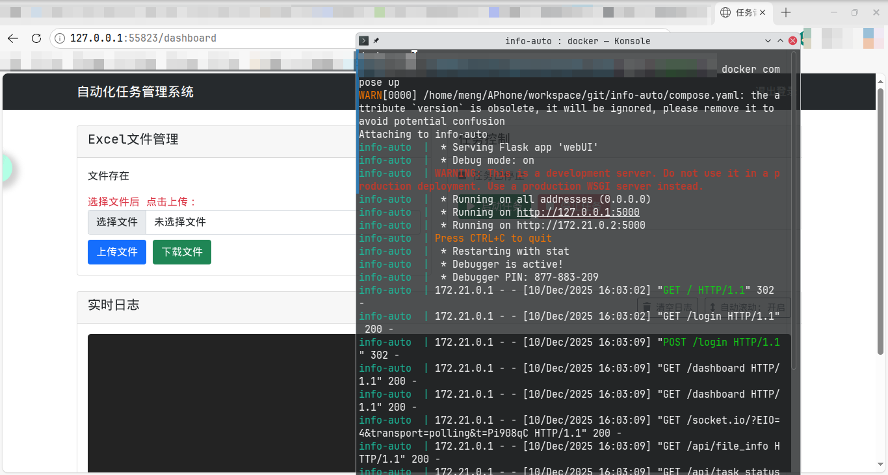

# info-auto
## 简介
将表格文件作为整个流程的数据库。
自动化处理，将子域名->host->nali->扩段->masscan->httpx 流程自动化，直接获取结果。
维护一个excel表(模板中结构不可修改)




## 安装
修改config.py
检查工具是否可以使用

本地搭建注意masscan需要root权限

1. nali
2. masscan
3. whatweb


```python
git clone https://github.com/ander1023/info-auto.git
cd info-auto
python -m venv venv
./venv/bin/pip install -r requirements.txt

python main.py
```
### docker

```
docker load -i info-auto13.tar
下载仓库代码替换后再启动
docker compose up -d

访问 IP:55823


docker compose down

```


## 使用

- config.py中有三个要修改 jwt密钥   账号  密码
- ./info-auto.xlsx 从子域名子表格的名称列中输入子域名，自动进行流程处理，并循环执行，直到全部状态为处理 。
- assets文件夹中有原始空白模板，以防丢失。
- 每个流程的过程日志会保留在log/xxx.log 对应工具的原始日志


## TODO

1. httpx subprocess执行失败 未找到原因
2. 增加一个webUI,在线启动任务与修改查看excel表格
3. 封装docker,一键启动


## idea
过程日志保存log/工具名.log
运行前检查是否重复
表格去重追加

## 模块
### host
输入：子域名
输出：
1. 可解析子域名：日志中address行的域名
2. 非CDN-IP: 聚合一行，没有alias的IP

逻辑：
1. 读取子表格《表格-子域名》
2. 读取《host处理状态》为空白的《名称》
3. 日志中address行ip填写到《对应IP》
4. 聚合一行，没有alias的IP 填写到《表格-非CDN-IP》的《名称》 并去重
5. 修改《host处理状态》为处理

###  nali&扩段
输入：非CDN-IP
输出：IP类型

逻辑：
1. 读取子表格《表格-非CDN-IP》
2. 读取《nali处理状态》为空白的《名称》
nali
3. 修改《类型》云ip或非云ip
4. 修改《nali处理状态》为处理
5. 云IP添加《表格-云IP+非云IP扩段》 并去重
扩段
6. 所有的！！！！非云IP扩段后的独立IP添加《表格-云IP+非云IP扩段》 并去重

### masscan
输入：非CDN-IP（云IP+非云IP扩段后的独立IP）
输出：IP-端口

逻辑：
1. 读取《表格-云IP+非云IP扩段》
2. 读取《masscan处理状态》为空白的《名称》
masscan
3. 处理个数小于60个的
3. 修改追加《表格IP-端口》
4. 状态修改为处理

### httpx
输入：IP-端口，可解析子域名，可解析子域名-端口
输出：可访问url

逻辑：
1. 全部IP端口追加《表格-http汇总》的名称 去重
2. 将所有IP端口的IP替换为子域名表格对应的子域名追加《表格-http汇总》 去重
3. 将所有有对应IP的子域名追加《表格-http汇总》
httpx
4. 追加《表格-httpx解析》名称


## 开发过程：工具函数定义
读取表格函数
数据据追加函数
追加去重
状态修改函数
