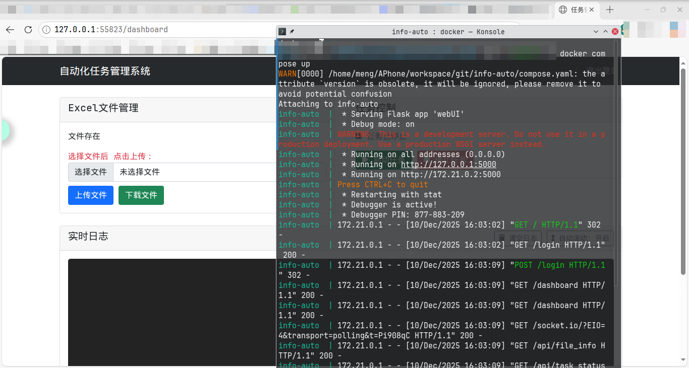

# info-auto
全新版本1.5（实际是1.3的再发版）
## 版本简介
1. 将表格文件作为整个流程的数据库。
2. 自动化处理：将子域名->host->nali->扩段->masscan->whatweb 流程自动化，直接获取结果。
3. 维护一个excel表(模板中结构不可修改)
4. 自动分批扫描，扫描完成更新状态，如若中断，重新开启即可，中断不会更新状态
5. 支持IP反查域名，可以通过表格初步筛选，更为详细在log文件夹中的日志（原始命令日志）

## docker安装
1. 下载Releases中1.5的info-auto-1.3.zip解压为info-auto-master
2. 下载Releases中1.5的info-auto13.tar 使用`docker load -i info-auto13.tar` 导入到docker images中
3. 进入info-auto-master目录，修改config.py文件，执行`docker compose up -d` 启动服务
4. 访问IP:55823

## 使用

1. config.py中可配置 jwt密钥   账号  密码 端口扫描速率
2. ./info-auto.xlsx 在子域名子表格的名称列中输入子域名，自动进行流程处理，并循环执行，直到全部状态为处理 。（项目只能从子域名解析往后走直至http解析）
3. assets文件夹中有原始空白模板，以防丢失。
4. 每个流程的过程日志会保留在log/xxx.log 对应工具的原始日志

## 待修复
- [ ] nali关键字筛选
- [ ] 扩段3个扩成30个
- [ ] 扩段去重失败

## 其他

[readme-self.md](readme-self.md)
